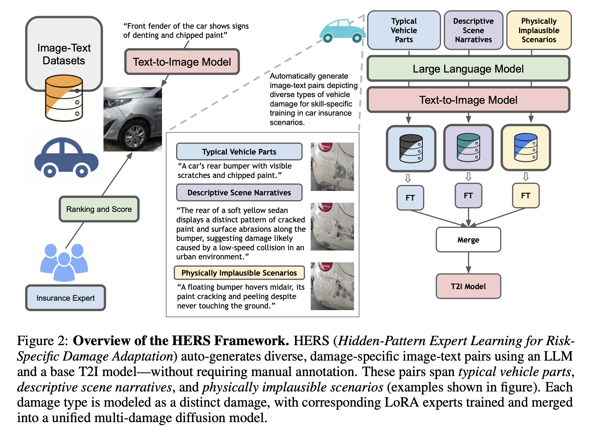
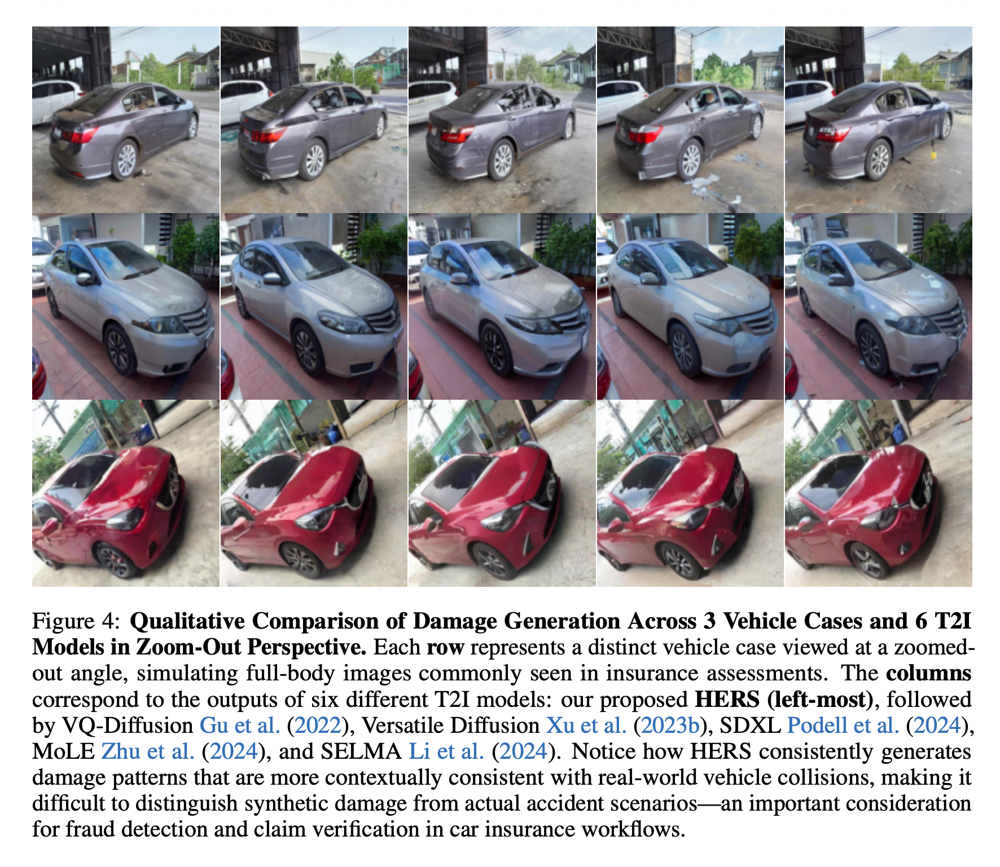

# 🚗 HERS: Hidden-Pattern Expert Learning for Risk-Specific Vehicle Damage Adaptation in Diffusion Models

  

**HERS** is a domain-adaptive diffusion framework designed to generate *forensically plausible*, *risk-aware* vehicle damage images for high-stakes applications such as **car insurance, fraud detection, and claim verification**.

Unlike generic text-to-image models that optimize for surface-level realism, HERS focuses on **hidden visual patterns**—subtle dents, asymmetric cracks, localized abrasions, and context-dependent damage cues—that matter in real-world insurance workflows.

This repository accompanies the **arXiv release** of our paper (originally submitted to ICLR 2026) and serves as a transparent, research-focused showcase of the ideas, results, and implications of HERS.

---

## ✨ Why HERS?

Modern diffusion models can already synthesize visually convincing car damage—but *visual realism alone is dangerous* in safety-critical domains.

In auto insurance:

* A **missing crack** can flip liability decisions
* A **misplaced dent** can invalidate fraud analysis
* A **physically implausible damage pattern** can mislead automated claim systems

HERS is built around one core question:

> **Can diffusion models learn the *semantic and forensic structure* of vehicle damage, not just its appearance?**

---

## 🔍 Qualitative Comparison: Fine-Grained Damage Fidelity

  

**Figure 1 — Damage-Level Visual Fidelity**
Comparison against strong diffusion baselines (SD v1.5, SDXL, MoLE, VQ-Diffusion, Versatile Diffusion).

**Key observation:**

* HERS preserves *localized consistency* across damage regions
* Fine-grained artifacts (dents, cracked paint, torn bumpers) remain coherent under zoom
* Baselines often hallucinate smooth textures or blur forensic cues

This level of detail is critical for downstream tasks such as expert review, claim auditing, and fraud simulation.

---

## 🧠 The HERS Framework

  

**Figure 2 — Overview of the HERS Framework**

HERS introduces a **fully automated, self-supervised adaptation pipeline**:

1. **LLM-driven prompt generation**

   * Typical vehicle parts (e.g., rear bumper, headlight)
   * Descriptive accident narratives
   * *Physically implausible scenarios* to expose hidden failure modes

2. **Text-to-Image synthesis** using a base diffusion backbone

3. **Damage-specific expert learning**

   * Each damage type (dent, scratch, crack, stain) → a lightweight LoRA expert

4. **Expert merging**

   * Experts are combined into a *single unified diffusion model*
   * No routing, no manual labels, no inference-time overhead

This design captures both **specialization** and **generalization**, enabling multi-damage synthesis in a single model.

---

## 📊 Quantitative Results: Human Preference & Realism

  

**Figure 3 — User Study Results**

HERS is evaluated across four dimensions:

* Car Stain Quality
* Car Damage Quality
* Car Part Quality
* Overall Image Quality

**Results:**

* Consistently higher human preference scores
* Significant gains over MoLE and Versatile Diffusion
* Improvements are *not cosmetic*—they reflect better semantic alignment

---

## 🌍 Zoom-Out Perspective: Full-Vehicle Consistency

  

**Figure 4 — Full-Body Damage Generation Across Vehicles**

Each row represents a distinct real-world vehicle scenario viewed from a zoomed-out insurance-style perspective.

**Why this matters:**

* Insurance images are rarely cropped
* Damage must remain consistent across panels, doors, and lighting
* Local realism without global coherence is insufficient

HERS produces damage patterns that align with **real collision physics**, making synthetic images difficult to distinguish from real accident photos.

---

## 🚨 Beyond Generation: Risk & Responsibility

HERS is not just a generative improvement—it is a **case study in dual-use AI**.

While high-fidelity damage synthesis enables:

* Rare-event simulation
* Data augmentation
* Robust model training

It also highlights risks:

* Fabricated accident evidence
* Manipulated insurance claims
* Synthetic fraud at scale

Our work argues that **domain-specific generative models must be paired with domain-specific safeguards**.

---

## 🧪 Key Contributions

* ✦ Introduce **risk-specific diffusion adaptation** for auto insurance
* ✦ Propose **HERS**, a self-supervised LoRA expert framework with no manual annotation
* ✦ Demonstrate state-of-the-art performance in text faithfulness, realism, and human preference
* ✦ Expose the forensic implications of high-fidelity generative models in insurance workflows

---

## 📄 Paper

**HERS: Hidden-Pattern Expert Learning for Risk-Specific Vehicle Damage Adaptation in Diffusion Models**
📌 *arXiv (coming soon)*

> This research is the product of independent effort and vision, driven by the goal of advancing trustworthy generative AI for real-world, safety-critical systems.

---

## 👤 Author

**Teerapong Panboonyuen**
🌐 [https://kaopanboonyuen.github.io/HERS](https://kaopanboonyuen.github.io/HERS)

---

## ⭐ If You Find This Useful

* Please ⭐ star the repository
* Cite the paper
* Reach out for collaboration in **AI for insurance, fraud detection, and trustworthy generative models**

> *Rejection is not the end of the story. Sometimes it’s just the proof that the idea is early.*